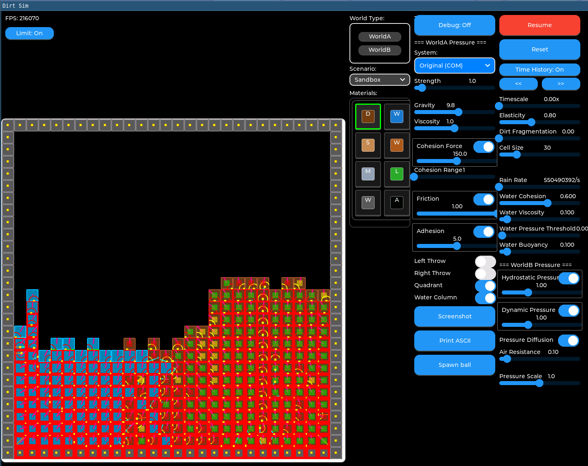

## Project Overview

DirtSim is a grid/cell-based playground for experimenting with artificial life, Yocto, and LVGL. It features multiple material types (AIR, DIRT, LEAF, METAL, ROOT, SAND, SEED, WALL, WATER, WOOD) with realistic physics including pressure, cohesion, adhesion, friction, and viscosity.



The simulation serves as a substrate for artificial life experiments, currently featuring tree organisms that germinate, grow, and respond to their environment.

## Target Hardware

* Raspberry Pi 4 or 5
* Pi4 display - MPI4008 4" HDMI touchscreen (480x800)
* Pi5 display - HyperPixel 4.0 DPI (480x800)
* Single unified image auto-detects hardware

## Repository Structure

```
dirtsim/
├── apps/              # Main simulation application (server, UI, CLI)
└── yocto/             # Yocto layer for building Pi images
```

### apps/ - The Simulation

The main application lives here. It's a client/server architecture:
- **Server**: Headless physics simulation with WebSocket API (port 8080)
- **UI**: LVGL-based display client with controls (port 7070)
- **CLI**: Command-line tool for control, testing, and benchmarking

### yocto/ - Pi Image Building

Custom Yocto layer for building bootable images for Raspberry Pi deployment. Includes recipes for the simulation and supporting infrastructure.

## Quick Start

```bash
cd apps
make debug                           # Build
./build-debug/bin/cli run-all        # Run server + UI
./build-debug/bin/cli integration_test  # Quick smoke test
```

## Documentation

| Document | Location | Description |
|----------|----------|-------------|
| Application docs | `apps/CLAUDE.md` | Build, run, test, architecture |
| Physics system | `apps/design_docs/GridMechanics.md` | Pressure, friction, cohesion, etc. |
| Coding conventions | `apps/design_docs/coding_convention.md` | Style guidelines |
| Tree organisms | `apps/design_docs/plant.md` | A-life tree feature |
| CLI reference | `apps/src/cli/README.md` | Command-line interface |
| Yocto deployment | `yocto/` | Yocto layer for building Pi images |

## Remote Deployment

The simulation runs on a Raspberry Pi 4 or 5, accessible at `dirtsim.local` (or custom hostname set during flash):

```bash
# Deploy from workstation (Yocto-based full system)
cd yocto
npm run yolo -- --hold-my-mead             # Build + deploy + reboot
npm run yolo -- --clean-all --hold-my-mead # Full rebuild

# SSH to Pi
ssh dirtsim.local

# Check service
systemctl status dirtsim-server
journalctl -u dirtsim-server -f

# Verify WebSocket endpoints from workstation
cd apps
./build-debug/bin/cli --address ws://dirtsim.local:8080 server StatusGet  # Server
./build-debug/bin/cli --address ws://dirtsim.local:7070 ui StatusGet      # UI
```

## Git Workflow

- Install hooks: `cd apps && ./hooks/install-hooks.sh`
- Pre-commit runs formatting, linting, and tests.
