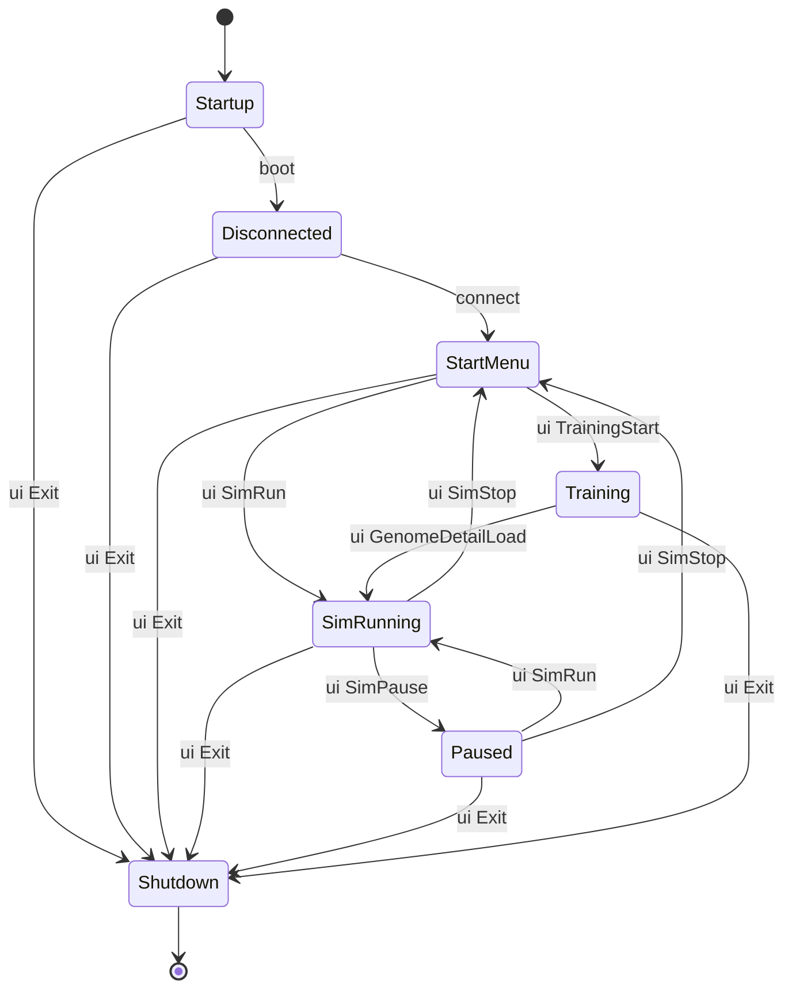

# DirtSim UI

LVGL-based client UI that connects to the headless server and drives simulation state,
controls, and training workflows.

## UI State Machine

The UI exposes a small state machine that can be queried and driven via the CLI.
These are the common states you will see from `ui StateGet`:

- `Startup`: bootstrapping UI and services.
- `Disconnected`: not connected to server yet.
- `StartMenu`: idle menu before simulation or training.
- `SimRunning`: simulation is running.
- `Paused`: simulation paused (renderer still active).
- `Training`: evolution/training workflow view.
- `Shutdown`: exiting UI.



## CLI-Driven Navigation

Use the CLI to move between UI states and open training views:

```bash
# Inspect state.
./build-debug/bin/cli ui StateGet
./build-debug/bin/cli ui StatusGet

# Start/stop simulation.
./build-debug/bin/cli ui SimRun
./build-debug/bin/cli ui SimPause
./build-debug/bin/cli ui SimStop

# Enter training and open genome browser.
./build-debug/bin/cli ui TrainingStart '{"evolution": {...}, "mutation": {...}, "training": {...}}'
./build-debug/bin/cli ui GenomeBrowserOpen

# Open/load a genome detail (from Training state).
./build-debug/bin/cli ui GenomeDetailOpen '{"id": "..."}'
./build-debug/bin/cli ui GenomeDetailLoad '{"id": "..."}'

# Exit UI.
./build-debug/bin/cli ui Exit
```

**Note:** `SimRun` and `TrainingStart` require the UI to be connected to the server.

## Panel Navigation

The Scenario/Physics/Core panels are managed by the icon rail and expandable panels.
There are no direct CLI commands for opening these panels yet.
TODO: Add explicit CLI navigation commands for these panels.

## Related Docs

- CLI usage and examples: `apps/src/cli/README.md`
- Architecture overview: `apps/design_docs/Architecture.md`
