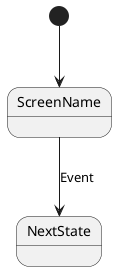

# DirtSim UI Docs

Local Markdown viewer for documenting DirtSim UI screens (PlantUML/Salt wireframes).

For state-aware screenshot capture, see `../STATE_MACHINE.md` for the UI states,
transitions, and the `StatusGet`/`StateGet` commands used to verify where the UI is.

## Run

```bash
npm install
npm run dev
```

If running from the repo root, you can also use:

```bash
npm install
npm run dev --workspace=dirtsim-ui-docs
```

## Add a screen

Drop a Markdown file into `src/screens/` and it will appear in the sidebar.

Suggested page template (wireframe + state flow):

```markdown
# Screen Name

```plantuml
@startsalt
scale 1.6
{ ... }
@endsalt
```



## States


```

## Render markdown screenshots

```bash
npm run shots:markdown
```

The output lands in `screenshots/markdown/`. This script uses a local Vite build (no dev server).
If Playwright has not downloaded browsers yet, run:

```bash
npx playwright install
```

If Chromium fails to launch in a sandboxed environment, try:

```bash
DOCS_SCREENSHOT_BROWSER=firefox npm run shots:markdown
```

PlantUML/Salt diagrams render via the repo Docker image (no local server).
Build the image once, then run screenshots:

```bash
cd ../../../../docker
make build-image
cd -
npm run shots:markdown
```

## Render real UI screenshots

In another terminal, start the UI (local example):

```bash
cd apps
./build-debug/bin/cli run-all
```

State checks (useful when captures are state dependent):

```bash
# Detailed status (state + selected icon + panel visibility).
dirtsim-cli ui StatusGet

# State only.
dirtsim-cli ui StateGet
```

StatusGet includes state-specific details via `state_details`. For Training:

```json
{
  "value": {
    "state": "Training",
    "selected_icon": "CORE",
    "panel_visible": true,
    "state_details": {
      "_variant_type": "DirtSim::UiApi::StatusGet::TrainingStateDetails",
      "trainingModalVisible": false
    }
  }
}
```

Then run:

```bash
npm run shots:real
```

Screens are captured via the CLI on the target device. The output lands in
`screenshots/real/`.

Start Menu variants:
- `start-menu`: StartMenu with no panel open (just the icon rail + background).
- `start-menu-home`: StartMenu with the Core/Home panel open.
- `start-menu-network`: StartMenu with the Network panel open.

## Stack real and markdown screenshots

After capturing both sets, generate comparison stacks:

```bash
npm run shots:stack
```

The output lands in `screenshots/compare/`, with the real screenshot on top and
the markdown version below. A red bar marks the real section, and a blue bar
marks the markdown section.

Optional environment overrides (defaults to dirtsim2.local):

```bash
DIRTSIM_SSH_HOST=dirtsim2.local
DIRTSIM_SSH_USER=dirtsim
DIRTSIM_REMOTE_TMP=/tmp/dirtsim-ui-docs
DIRTSIM_SSH_CONTROL_PATH=~/.ssh/cm-%r@%h:%p
DOCS_SCREENSHOT_ONLY=start-menu,start-menu-home,start-menu-network,training
DOCS_SCREENSHOT_MIN_BYTES=2048
```

Stacking overrides:

```bash
DOCS_REAL_DIR=screenshots/real
DOCS_MARKDOWN_DIR=screenshots/markdown
DOCS_COMPARE_DIR=screenshots/compare
```
