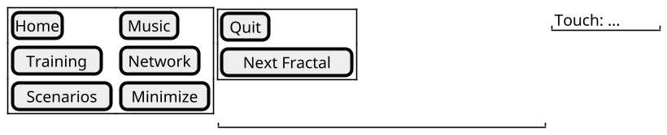
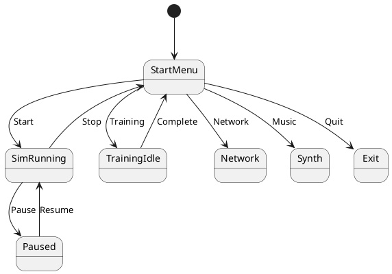

# Start Menu - Home

```plantuml
@startsalt
scale 1.6
{
  {+
    [Home] | [Music]
    [Training] | [Network]
    [Scenarios] | [Minimize]
  } | {
    {+
      [Quit]
      [Next Fractal]
    } | "Touch: ..."
    .
    "                               "
  }
}
@endsalt
```

## States

```plantuml
@startuml
[*] --> StartMenu

StartMenu --> SimRunning : Start
StartMenu --> TrainingIdle : Training
StartMenu --> Network : Network
StartMenu --> Synth : Music
StartMenu --> Exit : Quit

SimRunning --> Paused : Pause
Paused --> SimRunning : Resume
SimRunning --> StartMenu : Stop

TrainingIdle --> StartMenu : Complete
@enduml
```
