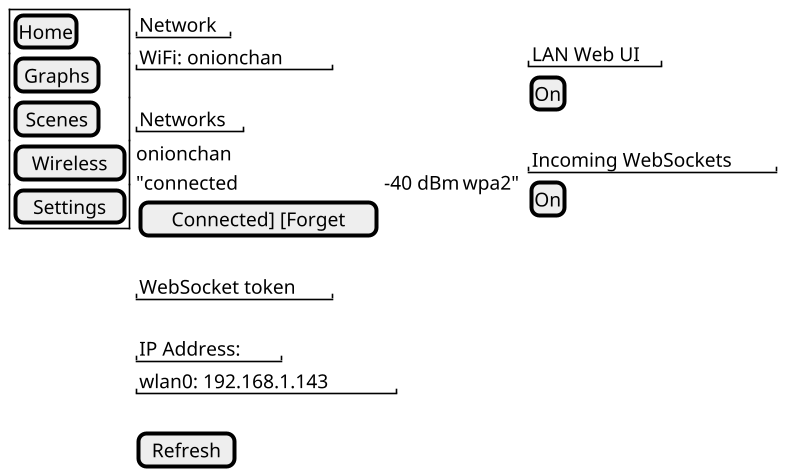
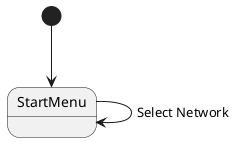

# Start Menu - Network

```plantuml
@startsalt
scale 1.6
{
  {+
    [Home]
    [Graphs]
    [Scenes]
    [Wireless]
    [Settings]
  } | {
    "Network"
    "WiFi: onionchan"
    .
    "Networks"
    {
      onionchan
      "connected | -40 dBm | wpa2"
      [Connected] [Forget]
    }
    .
    "WebSocket token"
    .
    "IP Address:"
    "wlan0: 192.168.1.143"
    .
    [Refresh]
  } | {
    .
    "LAN Web UI"
    [On]
    .
    "Incoming WebSockets"
    [On]
  }
}
@endsalt
```

## States

```plantuml
@startuml
[*] --> StartMenu

StartMenu --> StartMenu : Select Network
@enduml
```
