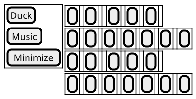
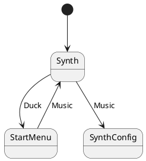

# Synth

Black keys overlay the white keys in a piano layout. Keys should be at least Action Size. The keyboard fills the content area with two stacked octaves (lower octave beneath the original row).

## States

