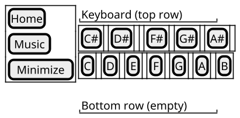
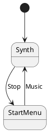

# Synth

```plantuml
@startsalt
scale 1.6
{
  {+
    [Home]
    [Music]
    [Minimize]
  } | {
    "Keyboard (top row)"
    {#
      [C#] | . | [D#] | . | . | [F#] | . | [G#] | . | [A#] | .
    }
    {#
      [C] | . | [D] | . | [E] | . | [F] | . | [G] | . | [A] | . | [B]
    }
    .
    "Bottom row (empty)"
  }
}
@endsalt
```

Black keys overlay the white keys in a piano layout. Keys should be at least Action Size.

## States

```plantuml
@startuml
[*] --> Synth

StartMenu --> Synth : Music
Synth --> StartMenu : Stop
@enduml
```
