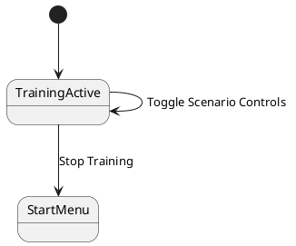

# Training Active (Scenario Controls)

```text
+------------------+  +------------------------------------------------------------------+  +------------------------+
| Stream           |  | Evolution                                                        |  | Best Command Histogram |
| Interval (ms)    |  | ...                                                              |  | ...                    |
| Best Playback    |  |  +--------------------------------------------+                  |  |                        |
| Best Playback ms |  |  | Scenario Controls: Clock                   |                  |  |                        |
| Scenario Controls|  |  | [Font: 7-Seg Large]                        |                  |  |                        |
| Stop Training    |  |  | [Height %] [0]                             |                  |  |                        |
| Pause            |  |  | [Digit Color] [Glow] [Seconds]             |                  |  |                        |
| CPU              |  |  | [Rain] [Obstacle Course] [Duck]            |                  |  |                        |
|                  |  |  | [Cycle] [Showcase] [Slide] [Marquee]       |                  |  |                        |
|                  |  |  | [Melt] [Timezone]                          |                  |  |                        |
|                  |  |  +--------------------------------------------+                  |  |                        |
|                  |  |   Current                          Best                          |  |                        |
|                  |  |  +----------------------+      +----------------------+          |  |                        |
|                  |  |  |                      |      |                      |          |  |                        |
|                  |  |  +----------------------+      +----------------------+          |  |                        |
|                  |  |                                                                  |  |                        |
+------------------+  +------------------------------------------------------------------+  +------------------------+
```

Training active view with the scenario controls flyout opened from the Stream column.
The flyout horizontally tracks the `Scenario Controls` button and is pinned to the top edge,
so it overlaps the left side of the Evolution panel without dropping off the bottom.

## States


