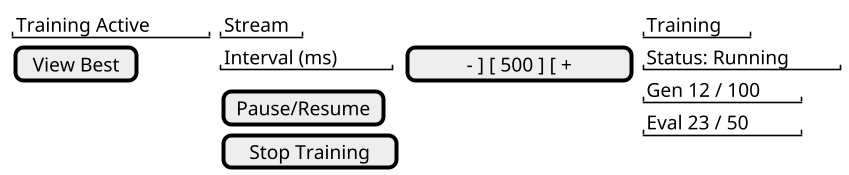
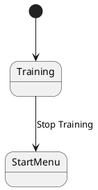

# Training Active

```plantuml
@startsalt
scale 1.6
{
  {
    "Training Active"
    [View Best]
  } | {
    "Stream"
    "Interval (ms)" | [ - ] [ 500 ] [ + ]
    [Pause/Resume]
    [Stop Training]
  } | {
    "Training"
    "Status: Running"
    "Gen 12 / 100"
    "Eval 23 / 50"
  }
}
@endsalt
```

## States

```plantuml
@startuml
[*] --> Training

Training --> StartMenu : Stop Training
@enduml
```
