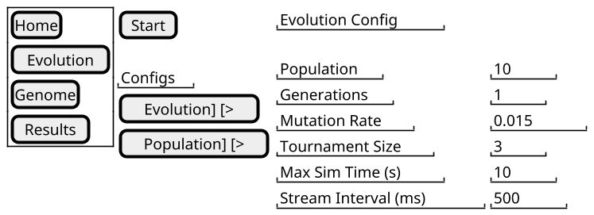
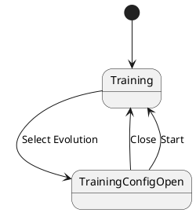

# Training Config (Evolution)

```plantuml
@startsalt
scale 1.6
{
  {+
    [Home]
    [Evolution]
    [Genome]
    [Results]
  } | {
    [Start]
    .
    "Configs"
    [Evolution] [>]
    [Population] [>]
  } | {
    "Evolution Config"
    .
    "Population" | "  10  "
    "Generations" | "  1  "
    "Mutation Rate" | "  0.015  "
    "Tournament Size" | "  3  "
    "Max Sim Time (s)" | "  10  "
    "Stream Interval (ms)" | "  500  "
  }
}
@endsalt
```

## States

```plantuml
@startuml
[*] --> Training

Training --> TrainingConfigOpen : Select Evolution
TrainingConfigOpen --> Training : Close
TrainingConfigOpen --> Training : Start
@enduml
```
