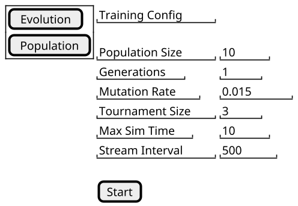
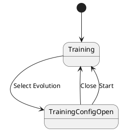

# Training Config

```plantuml
@startsalt
scale 1.6
{
  {+
    [Evolution]
    [Population]
  } | {
    "Training Config"
    .
    "Population Size" | "  10  "
    "Generations" | "  1  "
    "Mutation Rate" | "  0.015  "
    "Tournament Size" | "  3  "
    "Max Sim Time" | "  10  "
    "Stream Interval" | "  500  "
    .
    [Start]
  }
}
@endsalt
```

## States

```plantuml
@startuml
[*] --> Training

Training --> TrainingConfigOpen : Select Evolution
TrainingConfigOpen --> Training : Close
TrainingConfigOpen --> Training : Start
@enduml
```
