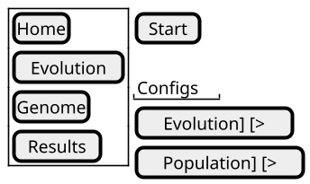
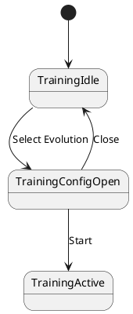

# Training Config

```plantuml
@startsalt
scale 1.6
{
  {+
    [Home]
    [Evolution]
    [Genome]
    [Results]
  } | {
    [Start]
    .
    "Configs"
    [Evolution] [>]
    [Population] [>]
    .
  }
}
@endsalt
```

## States

```plantuml
@startuml
[*] --> TrainingIdle

TrainingIdle --> TrainingConfigOpen : Select Evolution
TrainingConfigOpen --> TrainingIdle : Close
TrainingConfigOpen --> TrainingActive : Start
@enduml
```
