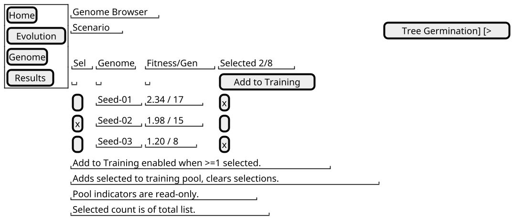
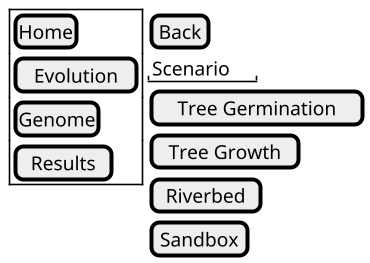

# Training Genome Browser

## List View

```plantuml
@startsalt
scale 1.6
{
  {+
    [Home]
    [Evolution]
    [Genome]
    [Results]
  } | {
    "Genome Browser"
    "Scenario" | [Tree Germination] [>]
    .
    {
      "Sel" | "Genome" | "Fitness/Gen" | "Selected 2/8"
      "" | "" | "" | [Add to Training]
      [ ] | "Seed-01" | "2.34 / 17" | [x]
      [x] | "Seed-02" | "1.98 / 15" | [ ]
      [ ] | "Seed-03" | "1.20 / 8" | [x]
    }
    "Add to Training enabled when >=1 selected."
    "Adds selected to training pool, clears selections."
    "Pool indicators are read-only."
    "Selected count is of total list."
  }
}
@endsalt
```

## Scenario Selector (Replaces List Column)

```plantuml
@startsalt
scale 1.6
{
  {+
    [Home]
    [Evolution]
    [Genome]
    [Results]
  } | {
    [Back]
    "Scenario"
    [Tree Germination]
    [Tree Growth]
    [Riverbed]
    [Sandbox]
  }
}
@endsalt
```
